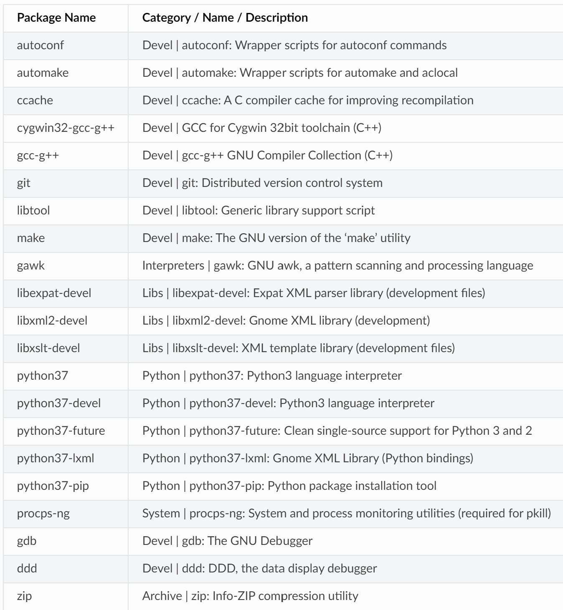

This document is a work in progress, the ROS community likes around 2 or 3
different simulators and most of the research was done with SITL (Software in
the Loop), however the other option that is recommended is Gazebo. SITL is
recommended by ardupilot and a lot of what is shown below is a condensed and
logical version however certain machines may find difficulty running it.

All Information comes from
https://ardupilot.org/dev/docs/sitl-native-on-windows.html and other links
within the webpage, if another operating system is used look at
https://ardupilot.org/dev/docs/SITL-setup-landingpage.html instead.

## Setting up SITL:

### Windows Setup:
1. go to Control Panel >> Programs >> “turn windows features on or off” >> the “Windows
subsystem for linux” should be switched on
2. go to Microsoft store >> Ubuntu and install/launch
3. Optional:
   1. If you are using Win10 you must install a XWindows (note Win11 already has one, so you
can skip this step if you run Win11). This tutorial uses VcXsrv however Cygwin X may be
a good alternative as well since other software by Cygwin will be used later.
VcXsrv: https://sourceforge.net/projects/vcxsrv/
Cygwin X: https://x.cygwin.com/
    2. It may be necessary to limit the memory and how many processes SITL uses by going to
as it may continue to use a large chunk of the memory/cpu power, refer to the following
for more: https://ardupilot.org/dev/docs/building-setup-windows10.html#building-setup-windows10
4. In Ubuntu (and later Cygwin) type 
    ```
    wsl --list --verbose and wsl --set-version Ubuntu 1 
    ```
    (or Ubuntu 2 depending on what wsl type you choose)
5. Then install MAVProxy, and the Cygwin terminal (it may be recommended to use mission
planner however it is less necessary, if you need another way to set up SITL without using
MAVProxy, you may use Mission Planner as a substitute)
MAVProxy: https://firmware.ardupilot.org/Tools/MAVProxy/
Cygwin Terminal: https://www.cygwin.com/install.html
Mission Planner:
6. When opening Cygwin follow the process through however accept all prompts and select
the following packages and finish the installation

    

7. After installing the packages, install the following compiler
`firmware.ardupilot.org/Tools/STM32-tools` (This can also be accessed here along with a
more detailed set of instructions of steps 6 - 8)
Follow the compiler through however enable “Add path to environment variable” along with
any other checkbox is ticked with installation
8. Follow the installation of MAVProxy and open the Cygwin Terminal recently installed and
add the following script:
    ```
    ln -s /usr/python3.7 /usr/bin/python
    ln -s /usr/python3.7 /usr/bin/pip
    pip install empy pyserial pymavlink
    ```
9. Then clone the ardupilot repository into the Cygwin Terminal
    ```
    git clone https://github.com/Ardupilot/ardupilot
    cd ardupilot
    git submodule update --init –recursive
    ```
10. Install the WAF file into the Cygwin Terminal
    ```
    curl -o waf https://waf.io/waf-2.0.25
    python verify-sig.py waf
    ```
    or...
    ```
    curl -o waf-2.0.25.tar.bz2 https://waf.io/waf-2.0.25.tar.bz2
    curl -o waf-2.0.25.tar.bz2.asc https://waf.io/waf-2.0.25.tar.bz2.asc
    gpg --verify waf-2.0.25.tar.bz2.asc
    ```
    all of which can be found https://waf.io/book/
11. That’s all if you need to run the simulation type the following into the Cygwin Terminal:
    ```
    cd ~/ardupilot/Rover
    ../Tools/autotest/sim_vehicle.py --map --console
    ```
12. Optional: If there is an error running the simulation, try adding the following to the bottom of the file ~/.bashrc
    ```
    export PATH=$PATH:$HOME/ardupilot/Tools/autotest
    ```
    Feel free to return to https://ardupilot.org/dev/docs/sitl-native-on-windows.html, there are
    more pages about how to run it within the section

## Setting up Gazebo: 

Gazebo is the second recommended simulator that a lot of the
ROS community uses, it's much more visual and comes more as a single package
however it interacts less with things like Mission Planner and Ardupilot has
less resources on it. I didn’t have enough time to cover it but it is a good
second option